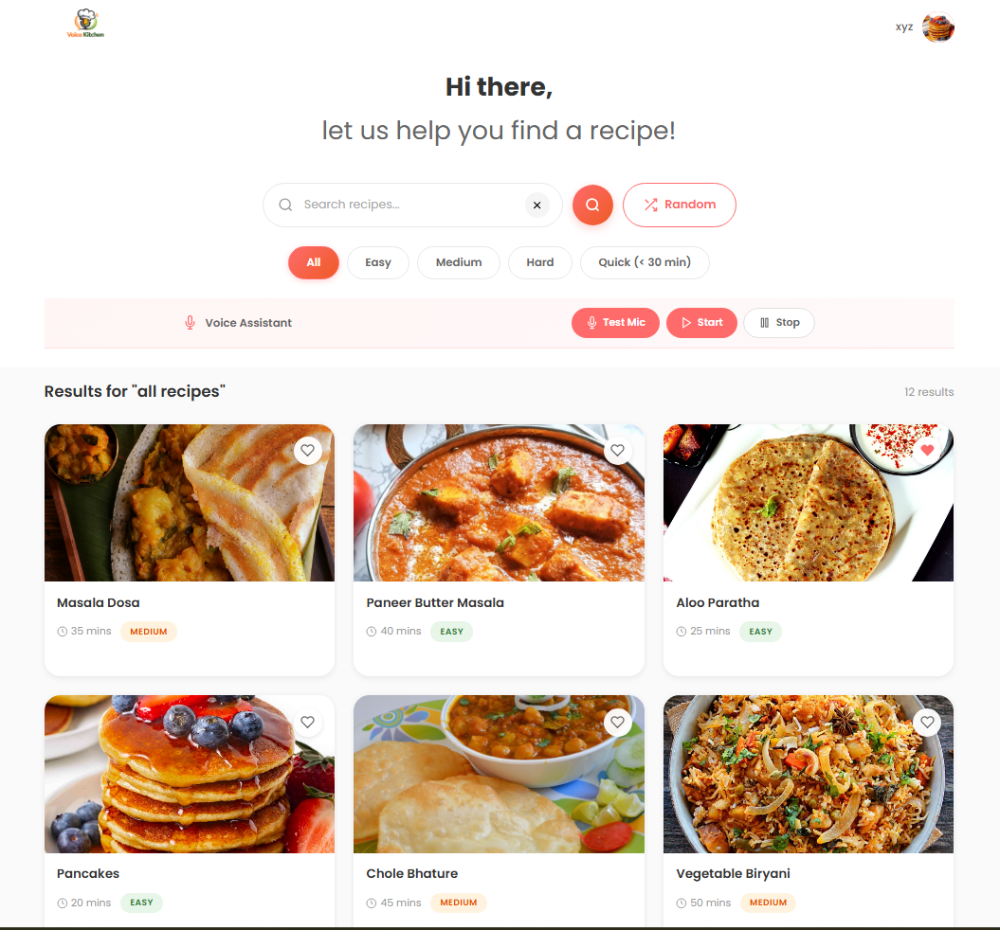
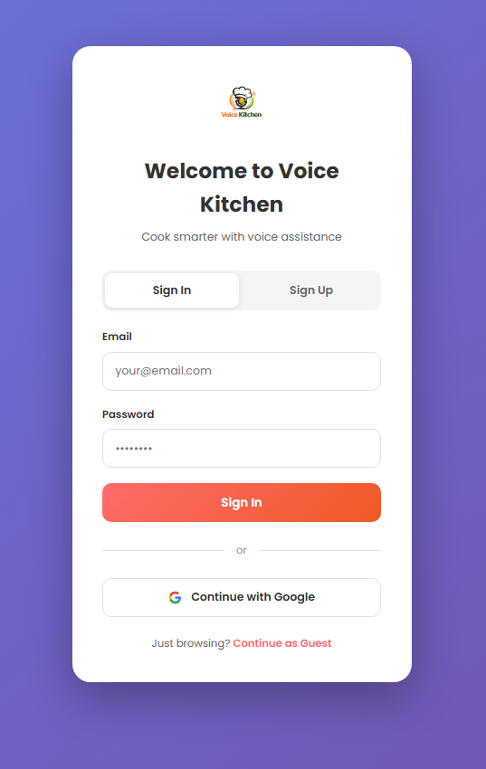
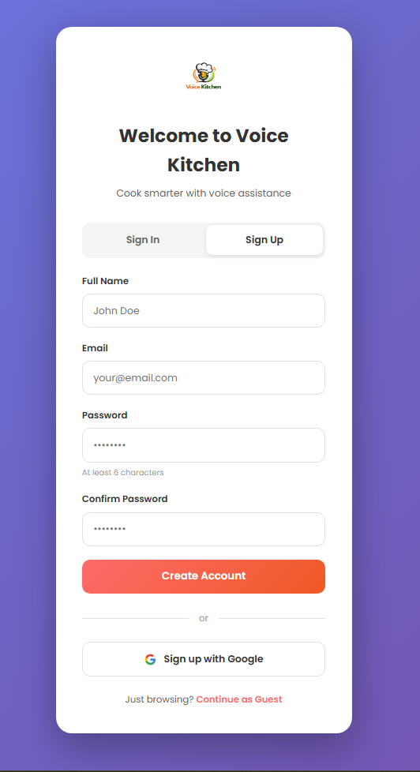
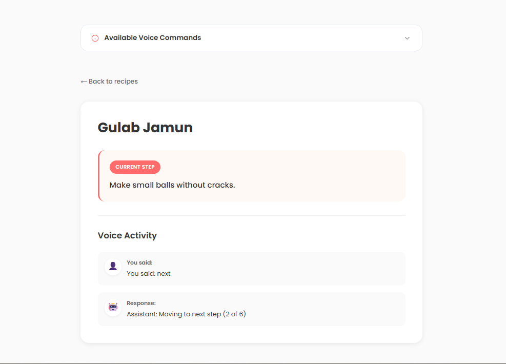
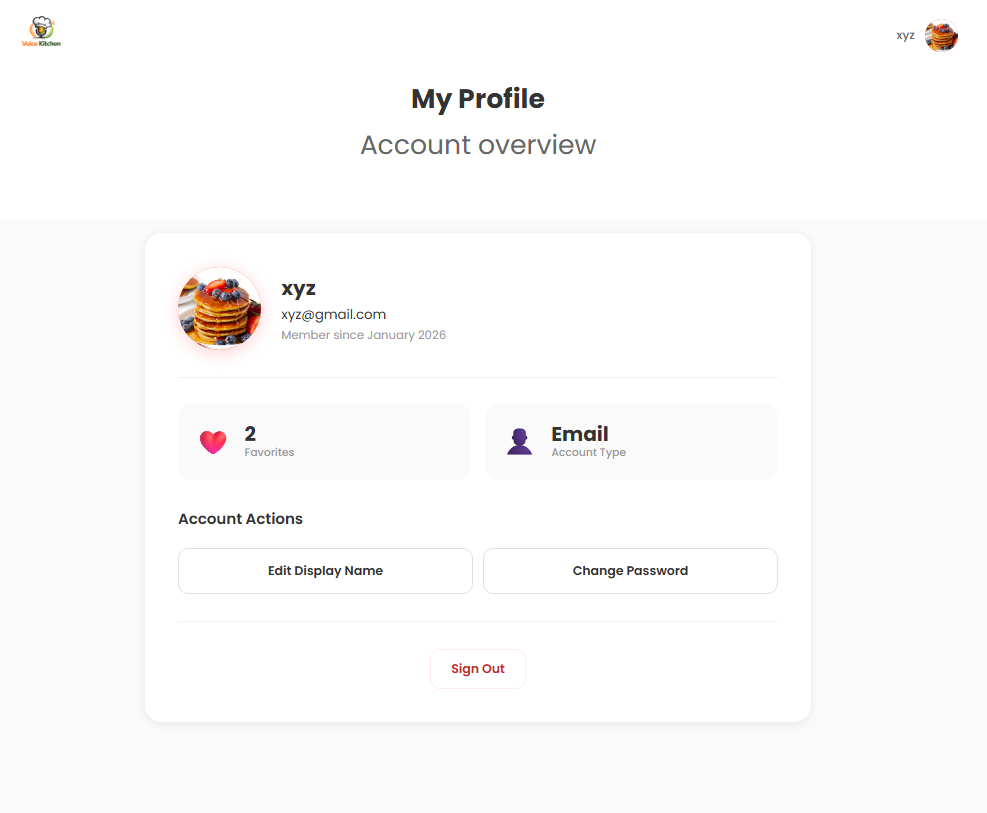
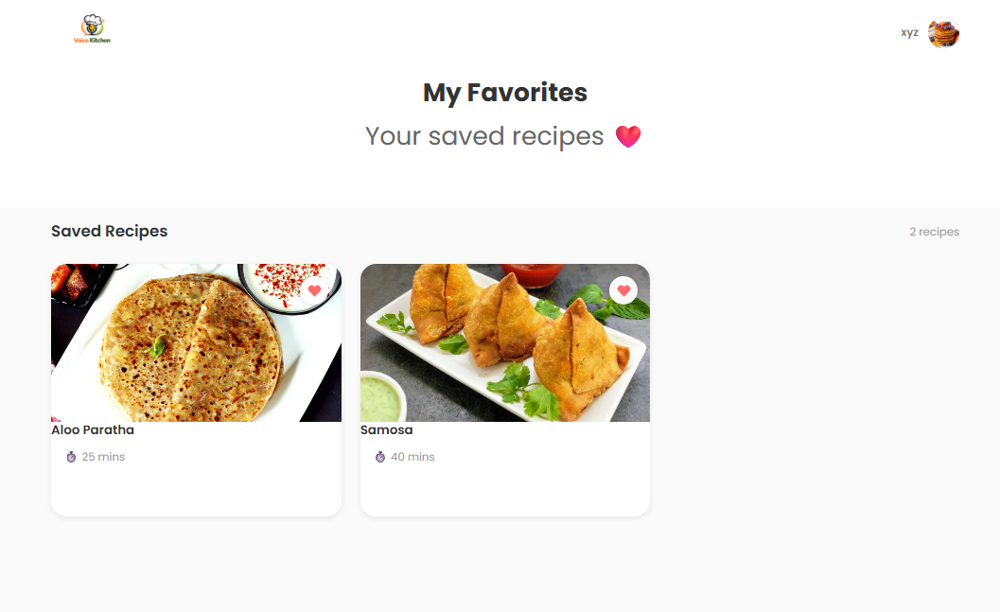

# 🎙️ Voice Kitchen - AI-Powered Voice Cooking Assistant

<div align="center">


**Cook Hands-Free with Voice Commands**

[](https://firebase.google.com)
[](https://developer.mozilla.org/en-US/docs/Web/API/Web_Speech_API)
[](https://spoonacular.com/food-api)
[](https://developer.mozilla.org)
[](CONTRIBUTING.md)

[Features](#-key-features) • [Demo](#-demo) • [Tech Stack](#-tech-stack) • [Getting Started](#-getting-started) • [Usage](#-usage-guide) • [Contact](#-contact)

</div>

---

## 📋 Table of Contents

- [About The Project](#-about-the-project)
- [Demo](#-demo)
- [Key Features](#-key-features)
- [Tech Stack](#-tech-stack)
- [Getting Started](#-getting-started)
- [Usage Guide](#-usage-guide)
- [Project Structure](#-project-structure)
- [API Documentation](#-api-documentation)
- [Screenshots](#-screenshots)
- [Roadmap](#-roadmap)
- [Contributing](#-contributing)
- [Contact](#-contact)
- [Acknowledgments](#-acknowledgments)

---

## 🎯 About The Project

**Voice Kitchen** is a hands-free cooking assistant that revolutionizes your cooking experience with voice commands. No need to touch your phone with messy hands - just speak, and let the AI guide you through each step!

### The Problem

- **85% of home cooks** struggle with checking recipes while cooking with messy hands
- **Average cook touches their phone 12+ times** per recipe, spreading germs and mess
- **Hard to follow recipes** when hands are busy chopping, mixing, or kneading
- **No real-time guidance** while cooking traditional recipes
- **Difficult to discover new recipes** matching your preferences

### Our Solution

Voice Kitchen leverages **Web Speech API** and **Spoonacular Recipe Database** to:
- Navigate recipes completely **hands-free** with voice commands
- Search **10,000+ recipes** from local and international cuisines
- Get **step-by-step voice guidance** with natural language understanding
- Save **favorite recipes** with cloud synchronization
- **Test microphone** before cooking to ensure smooth experience
- Support for **Indian recipes** including Pani Puri, Gulab Jamun, Masala Dosa, and more

---

## 🎬 Demo

### 🌐 Try It Live
> **Live Demo:** [https://voice-kitchen.web.app](https://voice-kitchen.web.app)

---

## ✨ Key Features

### 🎤 Voice-Powered Navigation
- **Hands-free control** - Navigate recipes without touching your device
- **Natural language commands** - Say "next", "previous", "repeat", "go to step 5"
- **Real-time voice feedback** - Assistant confirms your commands instantly
- **Web Speech API** integration with 95%+ accuracy
- **Support for Indian English** accent recognition

### 🔍 Smart Recipe Search
- **10,000+ recipes** from Spoonacular API
- **Real-time search** with instant results
- **Advanced filtering** - Easy, Medium, Hard, Quick (<30 min)
- **Local + API recipes** - Offline support with local recipe database
- **Indian cuisine support** - Automatic detection for dishes like Biryani, Samosa, etc.
- **Random recipe** generator for cooking inspiration

### 💾 Cloud-Powered Features
- **Firebase Authentication** - Email/Password + Google Sign-In
- **Real-time favorites sync** - Access saved recipes across devices
- **User profiles** - Custom avatars, display names, and preferences
- **Secure data** - Firebase Firestore with security rules
- **Guest mode** - Browse recipes without signing in

### 🎙️ Microphone Testing
- **Pre-cooking mic test** - Ensure your mic works before starting
- **Real-time transcription** - See what the assistant hears
- **Command recognition** - Test voice commands before cooking
- **Error handling** - Clear messages for permission/connection issues

### 📱 User-Friendly Interface
- **Clean, modern design** - Intuitive and easy to navigate
- **Recipe cards** with beautiful food images
- **Responsive layout** - Works on desktop, tablet, and mobile
- **Difficulty badges** - Quick visual indicators
- **Voice activity display** - See conversation history

---

## 🛠 Tech Stack

<table>
<tr>
<td valign="top" width="50%">

### Frontend
- **HTML5** - Semantic markup
- **CSS3** - Modern styling with custom properties
- **Vanilla JavaScript (ES6+)** - No frameworks needed
- **Web Speech API** - Voice recognition & synthesis
- **Responsive Design** - Mobile-first approach
- **Google Fonts (Poppins)** - Clean typography

</td>
<td valign="top" width="50%">

### Backend & APIs
- **Firebase Authentication** - User management
- **Firebase Cloud Firestore** - Real-time NoSQL database
- **Firebase Hosting** - Static hosting & CDN
- **Spoonacular API** - Recipe search & details
- **Firebase Security Rules** - Access control

</td>
</tr>
</table>

### Why This Stack?

| Technology | Reason |
|------------|--------|
| **Web Speech API** | Native browser support, no external dependencies, 95%+ accuracy |
| **Firebase** | Real-time sync, auto-scaling, 99.95% uptime, free tier available |
| **Spoonacular API** | 365,000+ recipes, detailed nutrition, step-by-step instructions |
| **Vanilla JS** | Lightweight, fast performance, no build tools required |

---

## 🚀 Getting Started

### Prerequisites

```bash
Node.js >= 14.x (for development server, optional)
Git
Firebase Account (free tier works!)
Spoonacular API Key (free tier: 150 requests/day)
Modern Browser (Chrome, Edge, or Safari for Speech API)
```

### Installation

1. **Clone the repository**
   ```bash
   git clone https://github.com/vaishnavi10200/voice-cooking-assistant.git
   cd voice-cooking-assistant
   ```

2. **Set up Firebase**
   
   a. Create a Firebase project at [Firebase Console](https://console.firebase.google.com)
   
   b. Enable services:
   - Authentication (Email/Password & Google)
   - Cloud Firestore
   - Hosting (optional, for deployment)
   
   c. Get your Firebase config from Project Settings
   
   d. Update `js/firebase-config.js`:
   ```javascript
   const firebaseConfig = {
     apiKey: "YOUR_API_KEY",
     authDomain: "YOUR_PROJECT.firebaseapp.com",
     projectId: "YOUR_PROJECT_ID",
     storageBucket: "YOUR_PROJECT.appspot.com",
     messagingSenderId: "YOUR_SENDER_ID",
     appId: "YOUR_APP_ID",
     measurementId: "YOUR_MEASUREMENT_ID"
   };
   ```

3. **Set up Spoonacular API**
   
   a. Get free API key at [Spoonacular API](https://spoonacular.com/food-api)
   
   b. Update `js/api-config.js`:
   ```javascript
   const API_CONFIG = {
     API_KEY: 'YOUR_SPOONACULAR_API_KEY',
     // ... rest of config
   };
   ```

4. **Configure Firestore Security Rules**
   
   Create these rules in Firebase Console → Firestore → Rules:
   ```javascript
   rules_version = '2';
   service cloud.firestore {
     match /databases/{database}/documents {
       // Users collection
       match /users/{userId} {
         allow read: if request.auth != null;
         allow write: if request.auth != null && request.auth.uid == userId;
         
         // Favorites subcollection
         match /favorites/{recipeId} {
           allow read: if request.auth != null && request.auth.uid == userId;
           allow write: if request.auth != null && request.auth.uid == userId;
         }
       }
     }
   }
   ```

5. **Run the application**
   
   **Option A: Simple HTTP Server (Python)**
   ```bash
   # Python 3
   python -m http.server 8000
   
   # Python 2
   python -m SimpleHTTPServer 8000
   ```
   
   **Option B: VS Code Live Server**
   - Install "Live Server" extension
   - Right-click on `index.html` → "Open with Live Server"
   
   **Option C: Node.js HTTP Server**
   ```bash
   npx http-server -p 8000
   ```

6. **Open in browser**
   ```
   http://localhost:8000
   ```

### 🔥 Firebase Deployment (Optional)

```bash
# Install Firebase CLI
npm install -g firebase-tools

# Login to Firebase
firebase login

# Initialize Firebase in project
firebase init

# Select:
# - Hosting
# - Use existing project
# - Public directory: . (current directory)
# - Single-page app: No

# Deploy to Firebase Hosting
firebase deploy

# Your app will be live at:
# https://YOUR_PROJECT_ID.web.app
```

---

## 📖 Usage Guide

### 🎯 Quick Start Guide

#### For New Users

1. **Browse as Guest** (Optional)
   - Click "Continue as Guest" on auth page
   - Search and view recipes
   - Limited features (no voice, no favorites)

2. **Create Account** (Recommended)
   - Click "Sign Up" tab
   - Enter name, email, and password (min 6 characters)
   - OR use "Sign up with Google"
   - Access all features instantly

#### Using Voice Assistant

1. **Select a Recipe**
   - Search or browse recipes
   - Click on any recipe card

2. **Test Your Microphone** (First Time)
   - Click "Test Mic" button
   - Allow microphone permissions when prompted
   - Speak a test command (e.g., "next")
   - Verify it recognizes your voice

3. **Start Cooking**
   - Click "Start" button in Voice Assistant bar
   - Listen to the current step
   - Use voice commands to navigate
   - Click "Stop" when done

### 🗣️ Voice Commands Reference

| Command | Action | Example |
|---------|--------|---------|
| **"Next"** | Go to next step | "Next", "Next step", "Move forward" |
| **"Previous"** / **"Back"** | Go to previous step | "Previous", "Go back", "Back" |
| **"Repeat"** | Repeat current step | "Repeat", "Say again", "Repeat step" |
| **"Go to step X"** | Jump to specific step | "Go to step 3", "Jump to step five" |
| **"Start over"** | Restart from beginning | "Start over", "Restart", "Begin again" |
| **"Stop"** / **"Pause"** | Stop voice assistant | "Stop", "Pause", "End session" |
| **"Help"** | List available commands | "Help", "What can I say" |

### 🔍 Search & Filter Tips

- **Quick Search**: Type dish name (e.g., "pasta", "biryani")
- **Filters**: Use difficulty badges for skill level
- **Quick Recipes**: Click "Quick (< 30 min)" for fast meals
- **Random Recipe**: Click "Random" button for inspiration
- **Clear Search**: Click × or "Clear Search" button

### ⭐ Managing Favorites

1. **Add to Favorites**
   - Click heart icon ❤️ on recipe card
   - Recipe saved to cloud instantly
   - Available on all your devices

2. **View Favorites**
   - Click profile icon → "Favorites"
   - See all saved recipes
   - Click recipe to start cooking

3. **Remove from Favorites**
   - Click filled heart ❤️ to unfavorite
   - Or remove from Favorites page

### 👤 Profile Management

1. **Edit Display Name**
   - Go to Profile page
   - Click "Edit Display Name"
   - Enter new name → Save

2. **Change Password** (Email accounts only)
   - Go to Profile page
   - Click "Change Password"
   - Enter current and new password

3. **Upload Avatar**
   - Go to Profile page
   - Click on your avatar
   - Select image (PNG/JPG, max 2MB)
   - Image saved to Firestore as base64

---

## 📁 Project Structure

```
voice-cooking-assistant/
│
├── assets/                      # Images and media
│   ├── voice-kitchen-logo.png   # App logo
│   ├── masala_dosa.jpg         # Recipe images
│   ├── paneer.jpg
│   └── ... (more recipe images)
│
├── pages/                       # HTML pages
│   ├── auth.html               # Authentication page
│   ├── favorites.html          # Saved recipes page
│   └── profile.html            # User profile page
│
├── js/                         # JavaScript modules
│   ├── main.js                 # Core app logic & voice control
│   ├── search.js               # Search & filter functionality
│   ├── favorites.js            # Favorites management
│   ├── auth.js                 # Authentication logic
│   ├── firestore.js            # Firestore database helpers
│   ├── profile.js              # Profile management
│   ├── recipe-api.js           # Spoonacular API integration
│   ├── storage.js              # (Reserved for future use)
│   ├── firebase-config.js      # Firebase configuration
│   └── api-config.js           # Spoonacular API config
│
├── index.html                  # Main application page
├── style.css                   # Global styles
├── recipes.json                # Local recipe database (fallback)
└── README.md                   # This file
```

### Key Files Explained

| File | Purpose |
|------|---------|
| `main.js` | Voice recognition, recipe selection, app initialization |
| `search.js` | Recipe search, filtering, API integration, UI rendering |
| `favorites.js` | Add/remove favorites, sync with Firestore |
| `auth.js` | Sign in/up, Google authentication, error handling |
| `firestore.js` | Database operations, avatar storage, favorites CRUD |
| `profile.js` | Profile editing, password change, avatar upload |
| `recipe-api.js` | Spoonacular API calls, recipe transformation |
| `recipes.json` | 12 Indian recipes for offline support |

---

## 📌 API Documentation

### Spoonacular API Integration

#### Recipe Search
```javascript
// Example: Search for recipes
const recipes = await RecipeAPI.searchRecipes('biryani', 0);

// Returns array of recipe objects:
[
  {
    id: 12345,
    title: "Chicken Biryani",
    time: "60 mins",
    difficulty: "medium",
    category: "Indian",
    image: "https://...",
    steps: ["Step 1...", "Step 2..."],
    servings: 4,
    isFromAPI: true
  }
]
```

#### Get Recipe Details
```javascript
// Fetch detailed recipe by ID
const recipe = await RecipeAPI.getRecipeDetails(12345);

// Returns complete recipe with nutrition, ingredients, etc.
```

#### Random Recipes
```javascript
// Get random recipes for inspiration
const randomRecipes = await RecipeAPI.getRandomRecipes(10);
```

### Firebase Firestore Schema

#### Users Collection
```javascript
// Document: users/{userId}
{
  avatar: "base64_encoded_image",
  displayName: "John Doe",
  email: "john@example.com",
  createdAt: Timestamp
}
```

#### Favorites Subcollection
```javascript
// Document: users/{userId}/favorites/{recipeTitle}
{
  title: "Paneer Butter Masala",
  time: "40 mins",
  image: "assets/paneer.jpg",
  steps: ["Heat butter...", "Add tomato..."],
  addedAt: Timestamp
}
```

### Web Speech API Usage

```javascript
// Initialize speech recognition
const recognition = new (window.SpeechRecognition || 
                        window.webkitSpeechRecognition)();
recognition.continuous = true;
recognition.interimResults = true;
recognition.lang = 'en-IN';

// Handle voice input
recognition.onresult = (event) => {
  const transcript = event.results[event.results.length - 1][0].transcript;
  processVoiceCommand(transcript);
};

// Speak text (Text-to-Speech)
const utterance = new SpeechSynthesisUtterance(text);
window.speechSynthesis.speak(utterance);
```

---

## 📸 Screenshots

### Main Dashboard


*Search recipes, filter by difficulty, and access voice assistant*

---

### Authentication Pages
<p>
  
  
</p>

*Email/Password and Google Sign-In options*

---

### Voice-Guided Cooking


*Step-by-step voice guidance with command history*

---

### User Profile


*Manage account, change password, upload avatar*

---

### Favorites Collection


*Access saved recipes across all devices*

---

## 🗺 Roadmap

### ✅ Phase 1 - MVP (Completed)
- [✅] Voice-powered recipe navigation
- [✅] Web Speech API integration
- [✅] Firebase Authentication (Email + Google)
- [✅] Spoonacular API recipe search
- [✅] Real-time favorites with Firestore
- [✅] User profiles with avatar upload
- [✅] Microphone testing feature
- [✅] Guest mode for browsing
- [✅] Responsive design
- [✅] Local recipe database (12 Indian recipes)

### 🚧 Phase 2 - Enhancement (In Progress)
- [ ] Performance optimization
- [ ] PWA support for offline usage
- [ ] Recipe ratings and reviews
- [ ] Shopping list generation
- [ ] Nutrition information display

### 🔮 Phase 3 - Advanced Features (Planned)
- [ ] Multi-language support (Hindi, Tamil, etc.)
- [ ] Recipe recommendations based on preferences
- [ ] Social sharing features
- [ ] Cooking timers with voice alerts
- [ ] Step-by-step images/GIFs
- [ ] Video recipe tutorials
- [ ] Meal planning calendar
- [ ] Grocery delivery integration
- [ ] Voice-controlled timer: "Set timer for 10 minutes"
- [ ] Ingredient substitution suggestions
- [ ] Dietary filters (vegan, gluten-free, etc.)

---

## 🤝 Contributing

Contributions make the open-source community an amazing place to learn, inspire, and create. Any contributions you make are **greatly appreciated**!

### How to Contribute

1. Fork the Project
2. Create your Feature Branch (`git checkout -b feature/AmazingFeature`)
3. Commit your Changes (`git commit -m 'Add some AmazingFeature'`)
4. Push to the Branch (`git push origin feature/AmazingFeature`)
5. Open a Pull Request

### Development Guidelines

- Write clean, commented code
- Follow existing code structure and naming conventions
- Test thoroughly before submitting PR (especially voice features!)
- Update documentation if needed
- Add screenshots for UI changes
- Ensure Firebase rules are secure
- Test on multiple browsers (Chrome, Edge, Safari)

### Bug Reports

Found a bug? Please open an issue with:
- Clear title and description
- Steps to reproduce
- Expected vs actual behavior
- Screenshots (if applicable)
- Browser and OS information

---

## 📞 Contact

**Developer:** Vaishnavi Saudagar

- 📧 Email: [vaishnavi03saudagar@gmail.com](mailto:vaishnavi03saudagar@gmail.com)
- 💼 LinkedIn: [Vaishnavi Saudagar](https://www.linkedin.com/in/vaishnavi-saudagar-a2115228b/)
- 🐙 GitHub: [@vaishnavi10200](https://github.com/vaishnavi10200)

**Project Link:** [https://github.com/vaishnavi10200/voice-cooking-assistant](https://github.com/vaishnavi10200/voice-cooking-assistant)

**Live Demo:** [https://voice-kitchen.web.app](https://voice-kitchen.web.app)

---

## 🙏 Acknowledgments

Special thanks to:

- [Web Speech API](https://developer.mozilla.org/en-US/docs/Web/API/Web_Speech_API) - For powerful voice recognition
- [Firebase](https://firebase.google.com) - For scalable backend infrastructure
- [Spoonacular](https://spoonacular.com/food-api) - For comprehensive recipe database
- [Google Fonts](https://fonts.google.com) - For beautiful Poppins typography
- The open-source community for inspiration and support
- All beta testers who provided valuable feedback

---

## 🌟 Star Us!

If you find this project useful or inspiring, please consider giving it a ⭐ on GitHub!

---

<div align="center">

**Made with ❤️ by Vaishnavi Saudagar**

**Powered by Web Speech API & Firebase**

[](https://developer.mozilla.org/en-US/docs/Web/API/Web_Speech_API)
[](https://firebase.google.com)
[](https://spoonacular.com/food-api)

</div>